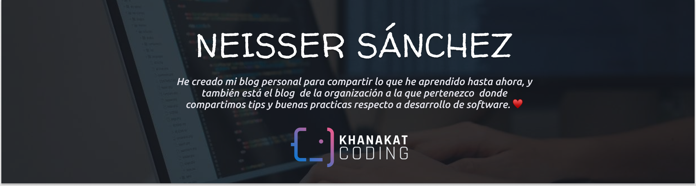

## HOLA 👋

#### Soy aún estudiante de Ingeniería de Computación y Sistemas de la Universidad Privada Antenor Orrego. En estos repositorios comparto lo que aprendí durante mi carrera y lo que estoy aprendiendo por mi cuenta, espero te sea útil.  ⚡ 
<!--
**NeisserMS/NeisserMS** is a ✨ _special_ ✨ repository because its `README.md` (this file) appears on your GitHub profile.

Here are some ideas to get you started:

- 🔭 I’m currently working on ...
- 🌱 I’m currently learning ...
- 👯 I’m looking to collaborate on ...
- 🤔 I’m looking for help with ...
- 💬 Ask me about ...
- 📫 How to reach me: ...
- 😄 Pronouns: ...
- ⚡ Fun fact: ...
-->
